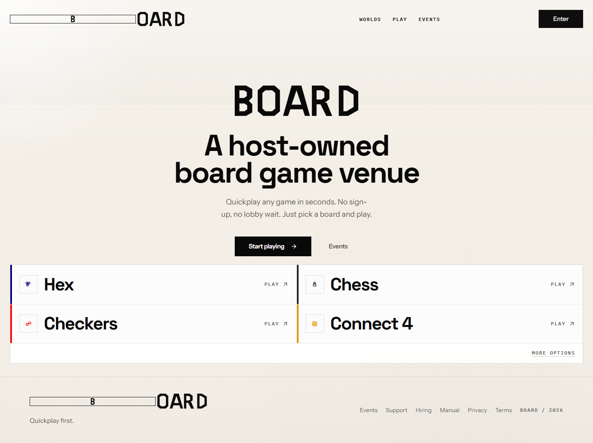
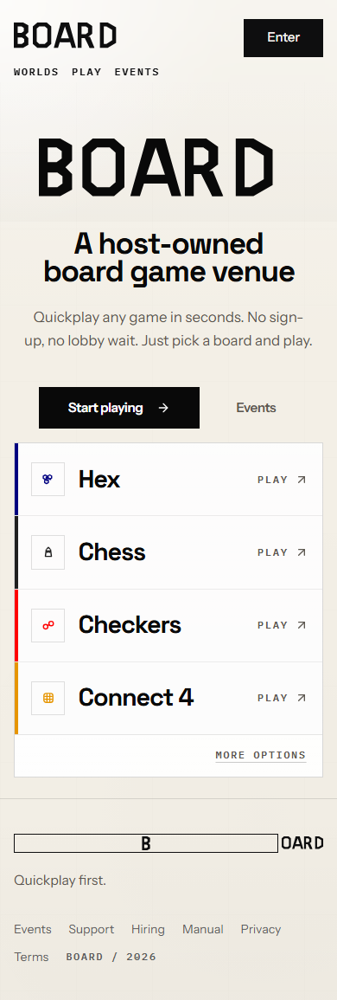
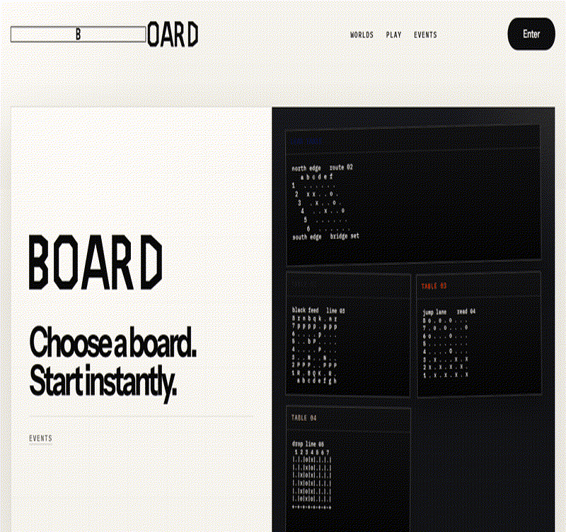

# BOARD

BOARD is a host-owned board-game venue for quickplay, ranked rooms, world-scoped events, AI opponents, bot matches, and replay review.

It is built as a real product surface, not a toy demo: React/Vite frontend, Supabase auth/data/realtime, registry-driven game engines, Railway-style API routes, World App identity flows, and an Expo wrapper for native experiments.

[Live site](https://www.hexology.me) | [Deployment notes](RAILWAY_DEPLOY.md) | [Contributing](CONTRIBUTING.md)

[](https://github.com/Zwin-ux/quiet-hex-logic/actions/workflows/ci.yml)
[](LICENSE)



## What To Look At First

If you are reviewing this repo quickly, start here:

- `src/lib/engine/registry.ts` - the game registry that lets routes, hooks, AI, and validators treat each game through one contract.
- `src/lib/engine/adapters/` - engine adapters for Hex, Chess, Checkers, Tic-Tac-Toe, and Connect 4.
- `src/pages/WorldAppHome.tsx` - compact World App play console with human proof, wallet gates, rooms, events, and profile state.
- `src/components/board/BoardWordmark.tsx` and `src/components/BoardLogo.tsx` - custom BOARD brand primitives.
- `src/components/Hero.tsx` - public landing composition.
- `server/index.ts` - Express app for `/api/chat`, runtime env injection, auth helpers, World App endpoints, and health checks.
- `supabase/functions/` - edge functions for moves, lobbies, tournaments, ratings, bots, and billing.
- `scripts/world-device-qa.mjs` - device-oriented World App QA harness.

## Product Surface

BOARD is organized around a few clear surfaces:

- **Quickplay** - pick a board and start without making the first screen feel like account setup.
- **Rooms** - open, share, and join board-game rooms by code.
- **Ranked play** - queue, resume, rematch, and track competitive state.
- **World App lane** - human proof plus wallet/pass-backed competitive entry.
- **Replay and AI coach** - review completed matches and ask for move context.
- **Bot Arena** - create token-based external bots and spectate bot-vs-bot matches.
- **Mods** - local-only rule packages for experimenting with new game variants.

## Screens

| Desktop | Mobile |
| --- | --- |
|  |  |

Motion capture:



## Built-In Games

| Game | Board | Multiplayer | Ranked | AI |
| --- | --- | --- | --- | --- |
| Hex | 7x7, 9x9, 11x11 | Online + local | Yes | Easy, Medium, Hard, Expert |
| Chess | 8x8 | Online + local | Yes | Easy, Medium |
| Checkers | 8x8 American | Online + local | Yes | No |
| Tic-Tac-Toe | 3x3 | Online + local | No | No |
| Connect 4 | 7x6 | Online + local | No | Easy, Medium, Hard |

## System Shape

```text
src/
  components/          UI, board surfaces, app shells, panels, modals
  hooks/               match state, match actions, auth, presence
  integrations/
    supabase/          generated types and Supabase client
  lib/
    engine/            shared GameEngine contract, registry, adapters
    hex/               Hex engine with DSU win detection
    chess/             chess.js-backed chess adapter
    checkers/          American checkers engine
    ttt/               Tic-Tac-Toe engine
    connect4/          Connect 4 engine
    mods/              local mod package schema and import flow
    discord/           Discord Activity integration
  pages/               route-level product surfaces

server/
  index.ts             Railway-style Express API and static server

supabase/
  functions/           Deno edge functions for game, lobby, tournament, bot, and billing flows
  migrations/          SQL migration history

scripts/
  world-device-qa.mjs  World App visual/auth/device preflight harness
```

## Game Registry

New games plug into the same registry pattern used by the existing five games.

```bash
npm run scaffold:game -- --key centerwin --name "Center Win"
```

That scaffold wires the engine, adapter, board component, registry entry, and server validator. The match page, lobby UI, and edge-function validation then consume the shared `GameEngine<TMove>` contract instead of one-off route logic.

## Local Setup

Prerequisite: Node 20 is the CI runtime.

```bash
npm ci --legacy-peer-deps
cp .env.example .env.local
npm run dev
```

The frontend runs on `http://localhost:8080`.

The app intentionally shows `Deployment Config Missing` until public Supabase values are present:

```text
VITE_SUPABASE_URL
VITE_SUPABASE_PUBLISHABLE_KEY
```

For the Railway-style API server:

```bash
npm run dev:server
```

The API server runs on `http://localhost:3001`, and the Vite dev server proxies `/api` to it.

## Useful Commands

```bash
npm run lint             # ESLint
npm test                 # Vitest
npm run build            # Vite production build
npm run build:server     # Compile Express server
npm run build:railway    # Build frontend + server for Railway
npm run serve:railway    # Serve production build through the Express app
npm run qa:world-device  # World App device/preflight harness
```

## Deployment Notes

The public site is currently served at `https://www.hexology.me`.

This repo also includes a Railway-first server path for app-facing APIs:

- static Vite bundle serving
- runtime public-env injection
- `POST /api/chat` through the AI SDK
- World App wallet/auth/verification endpoints
- `GET /api/health` for deploy checks

See [RAILWAY_DEPLOY.md](RAILWAY_DEPLOY.md) and [docs/WORLD_APP_DEVICE_QA.md](docs/WORLD_APP_DEVICE_QA.md) for the operational path.

## AI And Bots

Replay includes a Railway-backed AI coach that can explain visible moves and summarize turning points from replay context.

Bot Arena lets external runners connect with a bot token and play public spectated matches:

```bash
node tools/bot-runner/random.mjs
```

Bots earn ladder history in Season 0, while human ranked play stays separate.

## Mobile

The repo includes Expo commands for native wrapper work:

```bash
npm run ios
npm run android
npm start
```

World App remains the stricter release lane because MiniKit wallet auth, IDKit, native share, haptics, and WebView behavior need real-device proof.

## License

[MIT](LICENSE)
