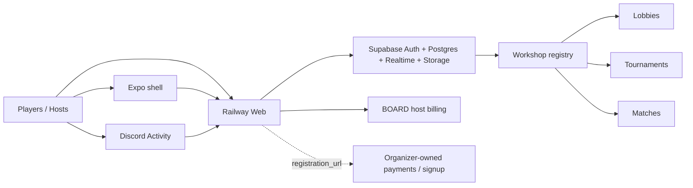
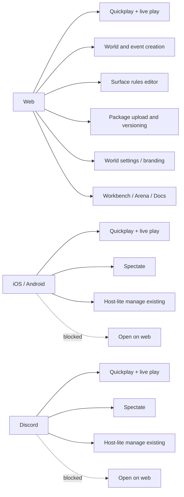
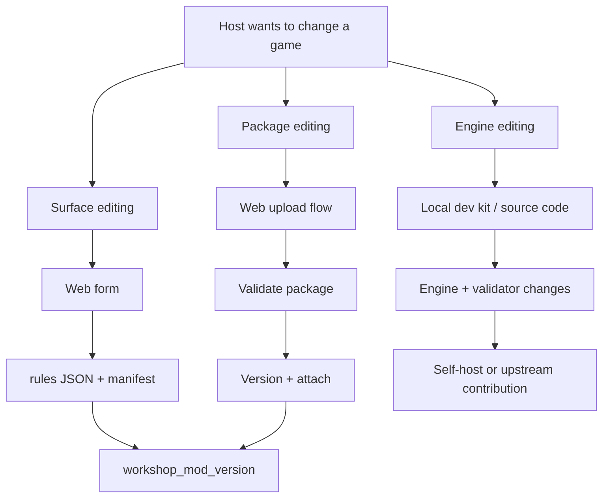
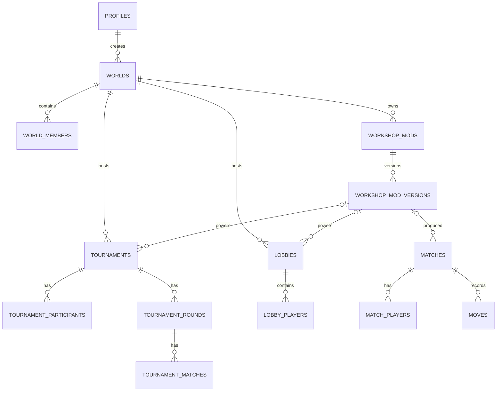

# BOARD Surface Split + Variant Editing v1

## Product split

- `Web`
  - full organizer surface
  - world creation and settings
  - tournament creation
  - surface rules editing
  - package upload and publishing
  - docs, workbench, arena
- `iOS / Android / Discord`
  - quickplay
  - join and play live matches
  - spectate
  - host-lite controls for existing rooms and events
  - web handoff for deep editing

## Editing modes

- `Surface editing`
  - form-driven
  - safe structured rules only
  - outputs `manifest + rules`
  - stored as `workshop_mod_version.source_kind = simple_editor`
- `Package editing`
  - upload `.openboardmod`, `.zip`, or `.json`
  - validate in browser
  - publish and version on web
  - stored as `workshop_mod_version.source_kind = package_upload`
- `Engine editing`
  - outside the browser
  - self-host / dev kit path

## Capability matrix

| Capability | Web | Mobile | Discord |
|---|---:|---:|---:|
| Quickplay | Yes | Yes | Yes |
| Join/play live | Yes | Yes | Yes |
| Spectate | Yes | Yes | Yes |
| Host-lite manage existing | Yes | Yes | Yes |
| Surface rules editing | Yes | No | No |
| Package upload/versioning | Yes | No | No |
| World settings/branding | Yes | No | No |
| Workbench/Arena/Docs | Yes | No | No |

## Official hosted variant pack

- `Hex`
  - `13x13 Championship`
  - `No Pie Classic`
- `Chess`
  - `Endgame Arena`
  - `Freestyle Chess` is held behind an engine gate until Chess960 castling is verified
- `Checkers`
  - `Chill Checkers`
- `Connect 4`
  - `Connect 3 Blitz`

## Runtime architecture

## Surface split

## Editing model

## Database model

## Schema additions

- `worlds`
  - `tagline`
  - `accent_color`
  - `public_status`
- `workshop_mods`
  - `world_id`
  - `scope`
  - `is_official`
  - `featured_rank`
  - `availability`
  - `engine_mode`
  - `validation_status`
- `workshop_mod_versions`
  - `source_kind`
  - `start_fen`
  - `start_seed`
  - `capabilities`
  - `validation_notes`
- `tournaments`
  - `mod_version_id`
  - `variant_seed`
  - `registration_url`
  - `access_type`
  - `access_code_hash`

## Current implementation notes

- Official variants are seeded into the workshop registry as `official_global`.
- World-private variants are readable by world members and writable by world organizers.
- Tournament live matches now inherit `mod_version_id` and the server rules snapshot from the tournament variant.
- `Freestyle Chess` remains a product-level gate until the Chess960 castling path is verified in both client and server validators.
